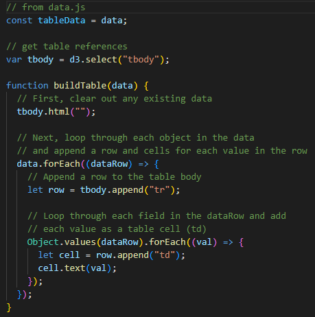
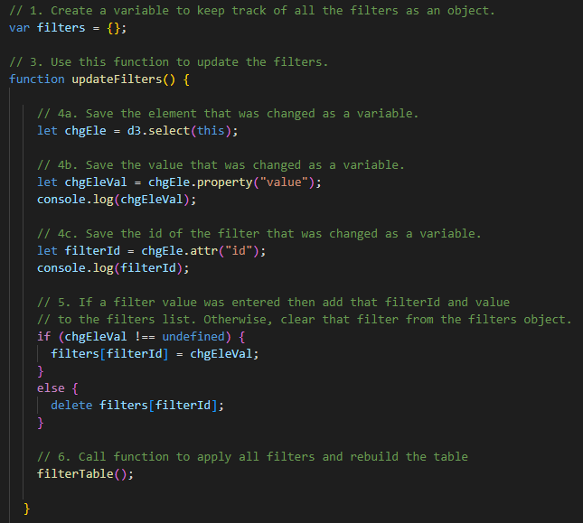
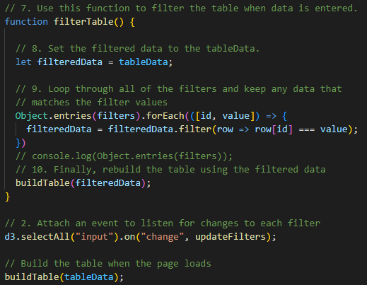
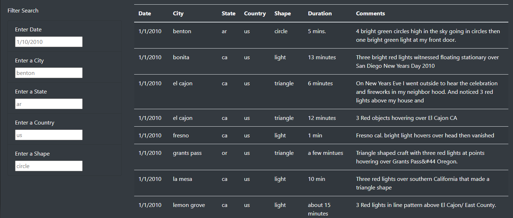
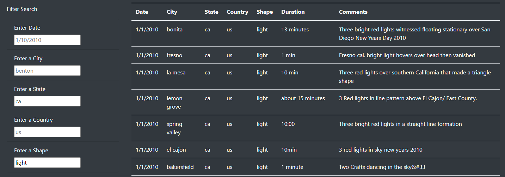

# UFO Sightings with JavaScript

## Overview of Project
In this module, Dana is developing a dynamic website where viewers can search UFO sighting data. She has a dataset of the sightings but needs to build the webpage with HTML to display the data, customize its appearance with Bootstrap, and allow users to filter the data with JavaScript. Throughout the module, we built the webpage, customized its appearance, and allowed users to filter the UFO sighting data by date. All that remains to do in this Challenge assignment is to add additional filters to website: city, state, and country where the sighting took place, as well as the UFO's shape.

The HTML and JavaScript used to create the website can be found in the Resources section below. The completed website can be found at: [https://seanwoodphd.github.io/UFOs](https://seanwoodphd.github.io/UFOs)

- **Deliverable 1: Filter UFO Sightings on Multiple Criteria**.
- **Deliverable 2: Write a Report on the UFO Analysis**.

## Resources
- Software: Visual Studio Code 1.75.0
- UFO Sighting Dataset: [data.js](static/js/data.js)
- HTML for Webpage: [index.html](index.html)
- CSS Styling: [style.css](static/css/style.css)
- JavaScript for Filtering: [app.js](static/js/app.js)

## Deliverable 1: Filter UFO Sightings on Multiple Criteria

The JavaScript to build and filter the table can be broken down into three sections/functions.

1. First, a function (buildTable) is created to initially build the table in the HTML page. This function is also called later to re-build the table after the data has been filtered.

    

2. Next, a function (updateFilters) is created that stores the values of the filter criteria that the user inputs.

    

3. Finally, a function (filterTable) is created that filters the table based on the criteria stored in Step 2. It then calls the buildTable function again to re-build the table with the filtered data.

    

## Deliverable 2: Report on UFO Analysis

### Results

When users visit the page, they are initially greeted by a large banner stating "The Truth is Out There" beneath which is a short blurb explaining the viewpoints of local proponents and opponents of UFOs. Finally, the user is prompted for their own opinion on UFOs and urged to dig into the data for themselves.

Below this introduction, users are presented with a table that initially contains all of the UFO sighting data in a large table, with the following information given for each sighting: the date and location (city, state, country) of the sighting, the shape of the UFO, the duration of the sighting, as well as any additional comments about the sighting. To the left of the table is a set of criteria by which the table can be filtered, including date, city, state, country, and shape. Each of these boxes is pre-filled with an example to show the user how to format their preferred criteria. To filter the data, the user simply types in their filter criteria and then either clicks off of the text box or hits the Enter key.

Once the user types filter criteria into any or all of the text boxes, the table on the right will automatically update to reflect only the data that matches ALL of the given criteria. The example below shows the table of results after applying the filters state: "ca" and shape: "light".

To reset the table and perform a new search, the user can simply click the "UFO Sightings" text at the top left corner of the page.

### Summary

One drawback to this website is that the filter terms have to be extremely precise: all lowercase and exact (not partial) matches. For instance, "el cajon" will provide results whereas "El Cajon" will not. Also, "el cajon" will provide results but "el" or "cajon" will not. Another drawback is that the UFO sighting dataset is very limited. It only includes about 2 weeks' worth of data from January 2010.

There are ways to improve upon these drawbacks. First, expand the way filters can be entered to include any case (uppercase, etc) and also partial results. A different solution would be to remove the textboxes altogether and replace them with drop-down menus (or scrollable menus where multiple options can be selected) so that users can only choose from data that exists in the table. Second, expand the database to include all sightings from the past 20 or 30 years.

Two additional recommendations for further development are as follows. First, create a map with points representing the location of each sighting and adjust the size of the points based on the number of sightings at that location. This map will give a better idea of where UFO sightings are more common. The data on the plot should reflect the filtered data as well. Second, create a bar chart that shows the frequency of UFO sightings over time (e.g. by month) to see if there is any seasonality to our extraterrestrial visits.